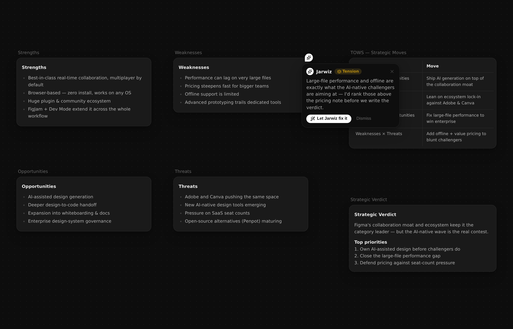

# Jarwiz

**Hand it a goal. Get back a board — not a chat.**

Jarwiz is an infinite canvas where AI is your collaborator, not a chatbot in a
sidebar. Type a subject or hand it a goal and it researches the live web, runs
real thinking frameworks (SWOT, Effort–Impact, competitive analysis, risk,
personas, 5 Whys…), and lays the answer out as a **board of cards you can move,
refine, and connect** — every artifact live, right where you're working.

Built for founders, product managers, and strategists. Open source (MIT) and
runs in your browser.

**[▶ Try the live demo](https://raagulmanoharan.github.io/Jarwiz-V3/)** · [Marketing site](https://raagulmanoharan.github.io/Jarwiz-V3/)



## Monorepo layout

```
apps/web         Canvas app — Vite + React + tldraw 5.1, custom card shapes, agent presence layer
apps/server      Thin agent server — link previews, SSE agent runs, holds API keys
packages/shared  @jarwiz/shared — the agent wire protocol and agent registry (single source of truth)
docs/            VISION, ARCHITECTURE, ROADMAP, DESIGN + the pivot specs
```

## Quickstart

Requires **Node ≥ 20** (developed on 22).

```sh
git clone https://github.com/raagulmanoharan/Jarwiz-V3.git
cd Jarwiz-V3
npm install
npm run dev
```

Open **http://localhost:5173**. The web app proxies `/api` to the server on
:3001 — `npm run dev` starts both together with HMR.

That's it — **the whole app works out of the box with no API key** (you'll see a
"Demo mode" badge; agents reply with high-quality scripted output so every flow
is demoable).

### Turning on live AI

For real Claude responses, **add an Anthropic API key** — that one key powers
everything (asks, deep web research, Autopilot, the Thinking Machines,
clustering, diagrams). Web search uses Anthropic's built-in `web_search` tool,
so nothing else is needed.

```sh
cp apps/server/.env.example apps/server/.env
# edit apps/server/.env → ANTHROPIC_API_KEY=sk-ant-...
```

Get a key at [console.anthropic.com](https://console.anthropic.com/). The key
lives only on the server — the browser never sees it.

> **No key handy?** If you have the Claude Code `claude` CLI installed and
> signed in, the server uses it as a keyless "sidecar" for real output
> automatically — a dev convenience, never required.

Check which mode you're in: `curl http://localhost:3001/api/capabilities`
→ `{"live":true,"mode":"api"}` (or `"sidecar"` / demo `{"live":false}`).

### Try it in 60 seconds

1. Answer "What are you working on?" (or skip) — drops you onto a board.
2. Drag out a few sticky notes (`n`) or a doc (`d`), or paste a link / drop a PDF.
3. Select 3+ stickies → **✦ Refine ▾ → Cluster & summarise** to watch them sort
   into named themes with a summary doc.
4. Select any card → use the bottom prompt bar's starter chips, or **Refine ▾ →
   Make a flowchart**. Watch the agent's cursor build it live on the board.

## Other scripts

```sh
npm run build       # build all workspaces
npm run typecheck   # tsc --noEmit across all workspaces
```

## Read the spec

Start at the docs index — **[docs/README.md](docs/README.md)** — which ties
together everything below:

- [docs/VISION.md](docs/VISION.md) — what Jarwiz is and why presence is the product
- [docs/ARCHITECTURE.md](docs/ARCHITECTURE.md) — system design, agent runtime, wire protocol
- [docs/DECISIONS.md](docs/DECISIONS.md) — the running decision log (what we chose and why)
- [docs/HISTORY.md](docs/HISTORY.md) — conversation / session history, milestone by milestone
- [docs/ROADMAP.md](docs/ROADMAP.md) · [docs/BIG-ROCKS.md](docs/BIG-ROCKS.md) — the plan and the priorities
- [CLAUDE.md](CLAUDE.md) — working notes / conventions for the codebase

## Contributing

Contributions are welcome. A few notes to keep the codebase coherent:

- Run `npm run typecheck` (web + server) before opening a PR — the web app also
  typechecks as part of `npm run build`.
- After changing anything in `packages/shared/src`, rebuild it so `dist/`
  regenerates: `npm run build --workspace=packages/shared`.
- Match the house style: design tokens over magic values (`--jz-*`), the `jz-`
  CSS class prefix, and agent identity colors from
  `packages/shared/src/agents.ts` (the single source). Motion cites a token and
  honors `prefers-reduced-motion`.
- Conventions and architecture live in [CLAUDE.md](CLAUDE.md) and
  [docs/ARCHITECTURE.md](docs/ARCHITECTURE.md).

Open an issue to discuss anything substantial before a large PR.

## License

[MIT](LICENSE) © Raagul Manoharan. Use it, fork it, ship it.

## Troubleshooting

- **Port already in use?** Web is 5173, server is 3001. Stop whatever's holding
  them, or set `PORT` in `apps/server/.env` (the Vite proxy expects 3001).
- **Fresh checkout typecheck errors referencing `@jarwiz/shared`?** Rebuild the
  shared package so `dist/` exists: `npm run build --workspace=packages/shared`.
- **PDF text/OCR:** the bundled `eng.traineddata` (Tesseract) ships in the repo,
  so dropped PDFs are read without any extra download.
