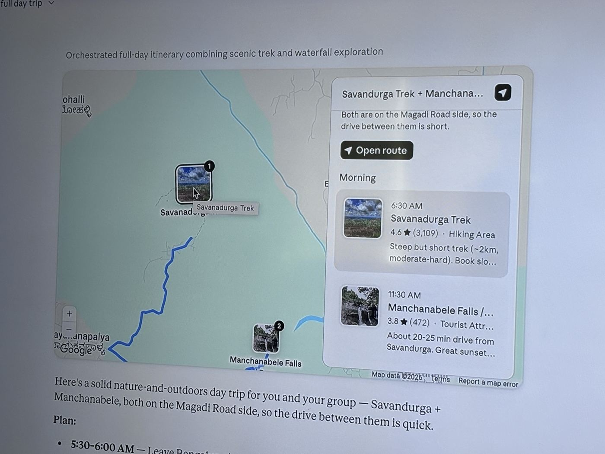

# MAPS.md — the map card (trip planning on the board)

_Owner ask (2026-07-11): "Need the rich card to support maps. It will be
useful for trip planning." Status: **plan of record for the feature** —
proposed, not built. Companion to ROADMAP §10 (queued build)._

## The ask, and the bar

The reference (a maps answer in a chat product):



What makes that card good, piece by piece:

1. **A real map with numbered pins** — the stops in visiting order, each pin
   wearing a photo thumbnail.
2. **A route line** connecting them, so the day has a shape.
3. **An itinerary rail** — stops grouped by time of day, each with a time, a
   name, a rating, a one-line note ("Steep but short trek… book slots").
4. **"Open route"** — one tap hands the whole plan to real navigation.
5. **A one-line thesis above the card** ("Both are on the Magadi Road side,
   so the drive between them is short") — the *reasoning* behind the geometry.

But it lives in a chat transcript: it scrolls away, it can't sit next to the
budget table, and follow-up questions can't point at it. That's the gap
Jarwiz exists to close.

## Why maps on a canvas beat maps in a chat

A trip is not one answer — it's a **working set**: the map, the day-by-day
plan, the budget, the packing list, the booking links, the "is October too
rainy?" question. Chat products regenerate the world on every turn. On the
board:

- The **map card is the anchor artifact**; day docs, budget tables and
  research cards sit *around* it, wired with provenance edges.
- **Asks ground on it** ("book slots for stop 1", "swap day 2 for something
  indoors") — the map is a source like any doc.
- Board scans get smarter: **"The board noticed" can flag timing/season
  issues** against real places ("Manchanabele is best at sunset — your plan
  has it at 11:30 AM").
- Compose ("plan my Goa weekend" board fan-out) can lay the map down as one
  card **in a set**, next to the itinerary and the budget — nobody else's
  answer has geography *and* structure *and* memory.

## User journeys

1. **The day trip.** Raagul types `/Map plan a nature day trip from
   Bengaluru — a trek plus a waterfall`. Jarwiz's avatar glides out, a map
   card materializes, and pins drop one by one — ①  Savandurga, ② Manchanabele
   — the avatar hopping pin to pin like the Writer hops table cells. He
   expands the card: itinerary rail with times and notes. "Open route" hands
   the plan to Google Maps on his phone.
2. **The refine.** He selects the map, types "add a good lunch stop between
   them". The card regenerates in place (same shape, `currentShape: 'map'`),
   now with ③ between ① and ②, the note explaining why that dhaba.
3. **The trip board.** `/Board plan our 3-day Coorg trip` fans out a map
   card, three day-plan docs, and a budget table — each day doc's places are
   the map's pins, connected by edges. The board *is* the trip; day-3 him
   returns to a place, not a transcript.

## What the card is (anatomy)

Three states, following the YouTube card's interaction precedent (inert at
rest; interactive only when deliberately entered) — a live map must never
steal the canvas's pan/zoom:

- **At rest (board view).** A quiet, theme-matched map viewport + numbered
  pins + the route + an `© OpenStreetMap` attribution line. No internal
  header — the title is the standard outside title tag, like every rich card
  (owner call 2026-07-11: cards don't grow chrome bars); status and the
  interaction hint are quiet overlay pills inside the viewport.
  **Pointer-inert**: drag moves the card, scroll pans the canvas.
  While streaming, pins drop in one at a time (materialize motion:
  `--jz-dur-base` / `--jz-ease-spring`, reduced-motion honored).
- **Editing (double-click).** The map goes live: pan/zoom inside the card,
  click a pin for its popover (name, note, "Open in Google Maps").
- **Focused (⤢ Expand → CardFocusOverlay).** The screenshot's layout: map on
  the left, **itinerary rail** on the right — stops grouped by day/section,
  each row with time · name · note · thumbnail; hover a row → its pin
  lifts; click → the map flies to it; "Open route" in the rail header.

Design notes: the basemap must sit inside the monochrome system — a
grayscale style in light (`--jz-surface` family), a dark style in dark; pins
use `--jz-accent` with `--jz-accent-ink` numerals; the rail is typeset like
the doc card, not like Google. No tldraw style panel (the `map-card` name
suffix hides it automatically).

### The inline map block (owner direction, 2026-07-11)

The standalone card is not the only home. When the user asks **normally** —
no `/Map` mode, "suggest a nature day trip from Bengaluru" — the answer is a
doc, as always; when the content is places, **the doc carries an inline map
block**: a fenced ` ```map ` block in the doc's markdown holding the stops
JSON, rendered inline by `DocMarkdown` the way mermaid diagrams already
lazy-render. This follows the exact doctrine of web-found images, which
already land in doc answers "when warranted" (2026-07-08) — the model
decides the *content* includes a map; it never overrides the explicit-shape
rule (the shape is still a doc).

- Anatomy: prose → map block (pins + dashed arcs + attribution, ~210px,
  `--jz-radius-md`) → a quiet toolbar line ("➤ Open route · ⤢ expand map")
  → the timed plan. **Numbered chips in the prose are the pins** — hover ①
  in the text and pin 1 lifts; the map assembles while the plan streams
  past it.
- Division of labour: the inline block is for when the map *illustrates*
  an answer; the standalone `/Map` card is for when the map *is* the
  artifact. "⤢ expand map" promotes the block into a full map card wired
  back to the doc with an edge.
- **Two modes, one block.** Stops that carry an order (a trip) render in
  *route mode*: numbered pins, dashed arcs (P2: real polylines), an "Open
  route" multi-waypoint deep link. A single pick or a shortlist ("good
  temple near Bengaluru", "3 cafés worth the drive") renders in *places
  mode*: plain unnumbered pins, **no route line**, and per-place "Open in
  Google Maps" links — options, not an itinerary. The stop JSON decides:
  `legs`/`time` exist only when order matters; the renderer keys on that,
  it never invents a route between unordered options. The focus view's
  rail follows suit: a timed plan in route mode, a places list in places
  mode (day/time group headers only when days/times exist).
- Plumbing: MAP_SYSTEM's stop-JSON grammar is shared; `DOC_SYSTEM` gains a
  short "when the answer is places, include a map fence" directive + the
  grammar. Pins geocode through a small `POST /api/geo/stops` endpoint
  (the same cached Nominatim helper — this pulls the public endpoint
  forward from P3), so a doc fence hydrates client-side without changing
  the doc streaming path at all: the fence is just markdown text until
  `card.done`, exactly like mermaid.

## Technology decisions (recommended, with alternatives)

| Decision | Recommendation | Why | Alternatives considered |
|---|---|---|---|
| Map renderer | **MapLibre GL JS** (BSD, no key), lazy-loaded chunk like `mermaid`/`pdfjs` | Vector tiles = crisp at any zoom, and the style is **plain JSON we can theme** to the light/dark monochrome system | Leaflet (lighter, but raster tiles can't match the design system); Google Maps JS (key + billing + look we can't own) |
| Tiles | **OpenFreeMap** public instance — free, **no API key, no registration, no usage limits**; attribution auto-added by MapLibre | Zero setup, no secrets, survives being a daily driver; styles (e.g. Positron) are already near-monochrome | MapTiler (nicer styles, needs key + quota); self-hosted PMTiles (later, if we ever want offline) |
| Geocoding (place → lat/lng) | **Nominatim (OSM), server-side only**, behind a cached helper in `apps/server` — mandatory cache, ≤1 req/s throttle, proper `User-Agent`, SSRF-guarded like `imageCache.ts` | Free and good enough for landmarks/POIs; the policy demands exactly the server-side caching we'd build anyway | Photon/komoot (faster, laxer, weaker for Indian POIs); model-emitted coordinates (hallucination risk — used only as a flagged fallback when geocoding misses) |
| Navigation hand-off | **Google Maps deep links** (`google.com/maps/dir/?api=1&…` with waypoints; per-pin `maps/search/?api=1&query=…`) | The screenshot's "Open route" with **zero API key/billing** — links are free; navigation happens in the app users already trust | Google Directions API (costs money, no benefit for hand-off) |
| Route line on our map | **P0–P1: dashed straight arcs** between numbered stops (honest "order", not "roads"); **P2: OSRM** public server via a cached, SSRF-guarded server proxy for real driving polylines + leg minutes | Ship the card without a routing dependency; arcs read clearly at board zoom | Valhalla/GraphHopper (keys/hosting); doing nothing (loses the day's "shape") |
| Stop photos | Reuse the existing **`find_image` / `/api/image` cache** pipeline (Google CSE when keyed, Wikipedia/Commons/Openverse keyless) | Already built, already cached, already degrade-to-nothing | Google Places Photos (key + billing) |
| Ratings ("4.6 ★ (3,109)") | **Cut.** We don't have a licensed source; the model's note carries the judgement ("steep but short, book slots") | Honesty > decoration; fake-looking ratings damage trust | Scraping (ToS risk), Places API (billing) |

Privacy note for DECISIONS.md when this lands: place-name queries leave the
machine to OpenFreeMap (tiles) and Nominatim (geocoding). Same class of
egress as link previews and image search — but it should be written down.

## Data model & wire protocol

### The shape (`map-card` props)

```
'map-card': {
  w, h: number
  title: string                     // "Savandurga + Manchanabele day trip"
  intro: string                     // the one-line thesis above the fold
  stops: Array<{
    id: string
    name: string                    // "Savandurga Trek"
    query: string                   // geocodable string, region-qualified:
                                    // "Savandurga Betta, Magadi, Karnataka"
    lat, lng: number
    approx?: boolean                // true when geocoding missed and we fell
                                    // back to model coords — pin renders hollow
    day?: string                    // "Day 1" | "Morning" — rail grouping
    time?: string                   // "6:30 AM"
    note?: string                   // one tight line, the model's judgement
    image?: string                  // /api/image-cached thumbnail (P1)
  }>
  legs?: Array<{ from, to: string; minutes?: number; km?: number;
                 polyline?: string }>   // P2 (OSRM); absent → dashed arcs
  status: 'running' | 'done' | 'error'  // dashboard convention; gates interaction
}
```

Registered in **both** the ShapeUtil (`static props`) and
`packages/shared/src/cardSchemas.ts` — in lockstep, per the file's contract.
(While there: `dashboard-card`, `sheet-card`, `machine-card` are missing from
`cardSchemas.ts` today — a latent sync-schema gap hidden because multiplayer
is parked. Fold the fix into the roadmap's Debt batch, don't widen this
feature.)

### The generation flow (server)

The **table pattern**, not the dashboard pattern: the payload needs
server-side enrichment (geocoding), so it can't stream as an opaque spec.

```
/api/ask  { prompt, shape: 'map' }            ← "/" mode only; no keyword routing
  └─ streamMap(user, signal)                   (new, in ask.ts)
      1. generate() with MAP_SYSTEM (+ web tools when warranted):
         model returns JSON { title, intro, stops[] (name/query/day/time/note) }
         — default token budget (~1400); a map spec is small
      2. emit card.create { shape:'map', title }
      3. per stop, in order:  geocode(query)   (cached; Nominatim; ≤1 rps;
         miss → model-coords fallback, approx: true)
         emit map.pin { index, name, lat, lng, day, time, note, approx }
         ← the avatar hops pin to pin, table.cell-style — presence is the product
      4. emit card.done, done
```

New `AskEvent` variant: `map.pin` (and `map.route` in P2), alongside
`table.cell` / `affinity.note` in `protocol.ts`. `AskShape` gains `'map'`.
After the shared change: `npm run build --workspace=packages/shared`.

Demo path (no key): `streamDemoAsk` gains a `map` branch streaming a canned
Bengaluru day trip (2–3 pins with real, hard-coded coords) — same events,
zero network. The geocode helper's cache seeds make it deterministic.

### Serving the pins honestly

Geocoding is the truth-risk: the model asking for "Savandurga" must not pin
a same-named place in another state. Mitigations, in order: (a) MAP_SYSTEM
requires **region-qualified `query` strings** (place, locality, state,
country); (b) geocode results are sanity-checked against the trip's bounding
region (all stops within ~500 km of the medoid — outliers get re-queried
with more context, then flagged `approx`); (c) `approx` pins render visibly
different (hollow ring) with a "location approximate" tooltip. Never
silently wrong.

## Integration map (from the codebase survey, 2026-07-11)

A shape kind is special-cased in ~30 places; there is no central registry.
The full checklist a `map-card` touches — grouped, with the anchor files:

**packages/shared** — `protocol.ts` (`AskShape` union + `map.pin` event),
`cardSchemas.ts` (`map-card` props). Rebuild the workspace after.

**apps/server** — `ask.ts` (dispatch branch in `streamAsk`, new `streamMap`,
`MAP_SYSTEM`, demo branch in `streamDemoAsk`, `SUGGESTABLE`/
`SHAPE_SUGGEST_SYSTEM` so the shape-suggest pass can propose Map);
`index.ts` (the `SHAPES` whitelist in `/api/ask` — **miss this and the shape
is silently dropped**); new `geo.ts` (geocode helper: cache + throttle +
`assertPublicHttpUrl` + `publicOnlyAgent`, modeled on `imageCache.ts`);
P2: `compose.ts` (`SHAPES` + `PLAN_SYSTEM`) and an OSRM proxy route.

**apps/web — the shape** — new `shapes/MapCardShapeUtil.tsx` (mirror
`DashboardCardShapeUtil.tsx`: props + `TLGlobalShapePropsMap` augmentation +
`MAP_CARD_SIZE`; MapLibre mounts in the card's own React DOM — **never a
sandboxed iframe**, which would block tile fetches); `shapes/index.ts`
(register in `cardShapeUtils`); `shapeTitle.ts` (`TITLE_PROP` + `TITLED`).

**apps/web — ask plumbing** — `useAsk.ts` (`REFINABLE`, `isInPlace`,
`toSource` — serialize stops as text so refines ground on them,
`sourceLabel`, the reducer: `card.create`/`map.pin`/`card.done` branches +
in-place reset + `ARTEFACT_LABEL`); `PromptBar.tsx` (`MODES`: `{ shape:
'map', label: 'Map', hint: 'pins & a route' }`); `CardActionBar.tsx` (a
`map-card` block: Add a stop · Reorder · Regenerate); `askable.ts`,
`refineIntent.ts` (`REFINE_SHAPE`), `ask/sync.ts` (`CONTENT_PROPS`),
`ask/suggestShape.ts` (`VALID`).

**apps/web — board fabric** — `agents/boardText.ts` (map joins
scans/compose as a text summary of its stops); `boards/boardSearch.ts`
(stop names searchable); `ui/CardFocusOverlay.tsx` (`FOCUSABLE` + a
`MapFocus` body — the itinerary-rail layout); `styles/index.css`
(`jz-map-*` namespace, tokens only); tidy/masonry allow-lists if gated.

**Conventions that bind:** `*-card` naming (hides the tldraw style panel
automatically); `jz-` class prefix; every motion cites `--jz-dur-*` /
`--jz-ease-*`; designed loading/error/empty states (tiles unreachable → the
pins still render on a plain token-colored backdrop with a quiet "map tiles
unavailable" line — degrade, never break).

## Phasing (one phase = one branch = one PR)

### P0 — The map speaks `M` — ✅ shipped 2026-07-11 (this PR)
The card exists and the Ask pipeline can produce it.
- Shared types + schemas; `streamMap` + `MAP_SYSTEM` + geocode helper +
  demo branch; `SHAPES` whitelist.
- `MapCardShapeUtil` (rest + editing states), MapLibre as a lazy chunk,
  light/dark basemap styles, numbered pins, dashed-arc route, attribution.
- `/Map` mode in the prompt bar; `useAsk` reducer branches; pin-by-pin
  streaming with the avatar hop; per-pin "Open in Google Maps" link.
- **Exit:** `/Map plan a trek + waterfall day trip from Bengaluru` → a map
  card materializes, pins drop one by one, each opens correctly in Google
  Maps; works keyless via the demo path; typecheck/build green; screengrab
  on the PR.

### P1 — The trip card (screenshot parity) `M` — ✅ shipped 2026-07-11 (this PR; thumbnails + chip↔pin hover deferred to P3 polish)
- `MapFocus` overlay: map + itinerary rail (day/time groups, notes,
  thumbnails via `find_image`), row↔pin hover/fly-to sync.
- "Open route" (multi-waypoint Google Maps deep link) on card + rail.
- Refine loop: map grounds asks (`toSource`), in-place regenerate, action
  bar block (Add a stop · Reorder · Regenerate).
- **The inline map block in doc answers** (see anatomy above): the
  ` ```map ` fence in `DocMarkdown`, the `DOC_SYSTEM` when-warranted
  directive, `POST /api/geo/stops`, chip↔pin hover, "⤢ expand map"
  promotion to a full map card.
- **Exit:** the expanded card reads like the reference image (minus
  ratings); "add a lunch stop" regenerates in place with the new pin; a
  plain "suggest a day trip" ask answers as a doc that carries its map.

### P2 — Trips are a board thing `M`
- Compose fan-out can plan a map slot (trip intents → map + day docs +
  budget table, edges wired).
- Board fabric: scans/notice see the map ("sunset spot scheduled at
  11:30 AM"), board search finds stops.
- Real driving routes: OSRM via cached server proxy; leg minutes/km in the
  rail; polylines replace arcs when present.
- **Exit:** `/Board plan our 3-day Coorg trip` yields a connected set with
  the map as anchor; a notice can point at a real timing conflict.

### P3 — Hardening & hands-on editing `S–M`
- WebGL budget: snapshot-to-image at rest, live map only while
  editing/focused (browsers cap ~8–16 contexts; boards can hold many maps).
- Manual editing: drag a pin to nudge, add a stop by search box (the
  geocode helper gets a real endpoint), delete/reorder from the rail.
- Eval: `scripts/eval-map.mjs` driving the real flow (mode → stream → pins
  → deep-link URLs well-formed), honest about sandbox tile flakiness.

## Risks & mitigations

- **Wrong pins** (geocoding ambiguity) → region-qualified queries, medoid
  sanity check, visible `approx` state. Never silently wrong.
- **Nominatim policy** (1 req/s, mandatory caching, no bulk) → server-side
  cache keyed by query, throttle, custom UA; trips are 3–10 geocodes and
  mostly cache hits. Jarwiz is nowhere near "geocoding-primary" use.
- **Provider disappears** (OpenFreeMap is donation-run) → style URL is one
  config point; MapTiler-with-key is a drop-in fallback; the card's
  no-tiles degrade state means the board never breaks.
- **Canvas gesture conflict** (map eats pan/zoom) → YouTube precedent:
  inert at rest, live only in edit/focus. Non-negotiable.
- **Too many live maps** → P3 snapshot-at-rest; until then, maps stay live
  but tiles are cached and cheap; watch it on real boards.
- **Sandbox can't reach tiles** in this dev environment → the eval asserts
  pins/events/links, not tile pixels; screenshots may show the degrade
  state — say so on the PR rather than faking it.
- **Scope creep toward a travel product** (bookings, live traffic, transit)
  → out of scope, below.

## Non-goals (deliberate)

No Google Places/Directions APIs (billing + lock-in; deep links deliver the
hand-off). No star ratings (no licensed source — the model's note carries
judgement). No live traffic, transit schedules, or booking. No offline
tiles. Multiplayer concerns stay parked with multiplayer itself.

## Definition of done

ROADMAP §8 applies per phase (tokens, designed states, keyboard + AA,
reduced-motion, green typecheck/build, screenshot on PR). The feature-level
bar: **a first-time viewer watches pins drop onto a real map one by one and
says "it's planning my trip on the board"** — presence, artifact, and
provenance in one card.
