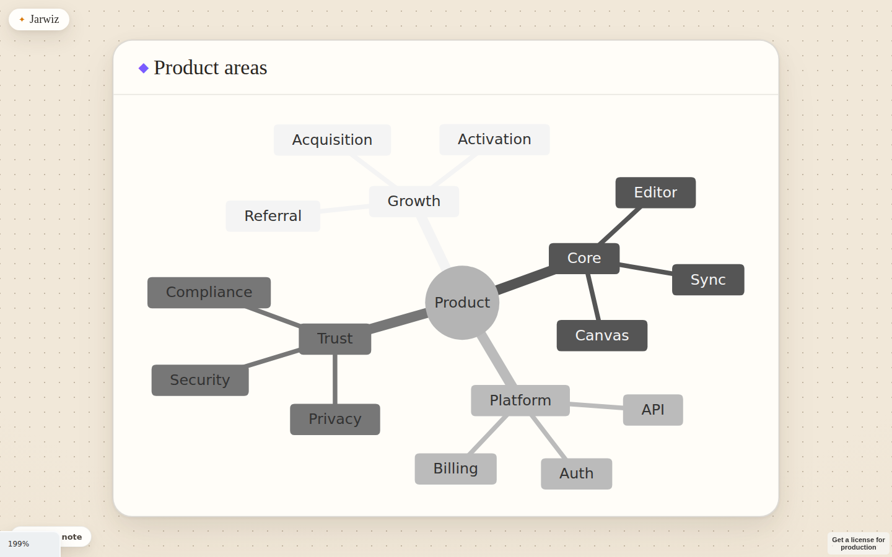
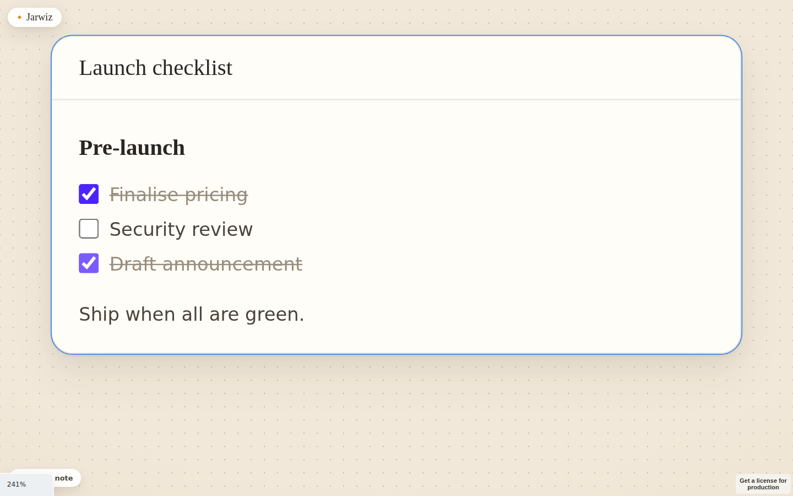
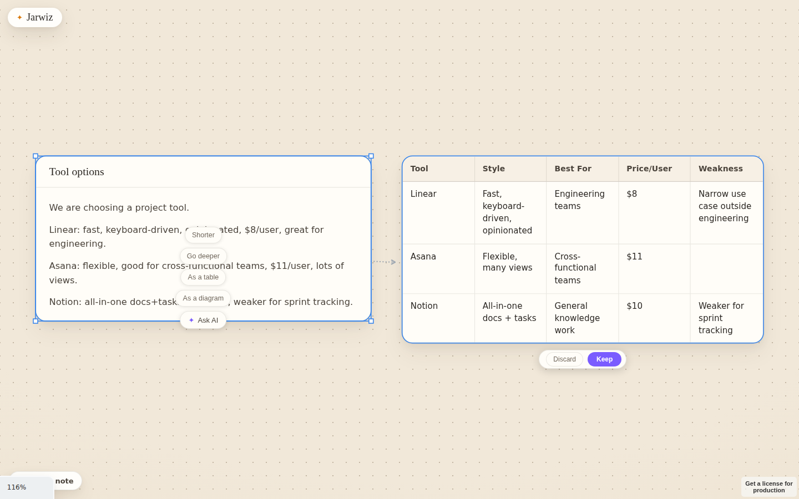
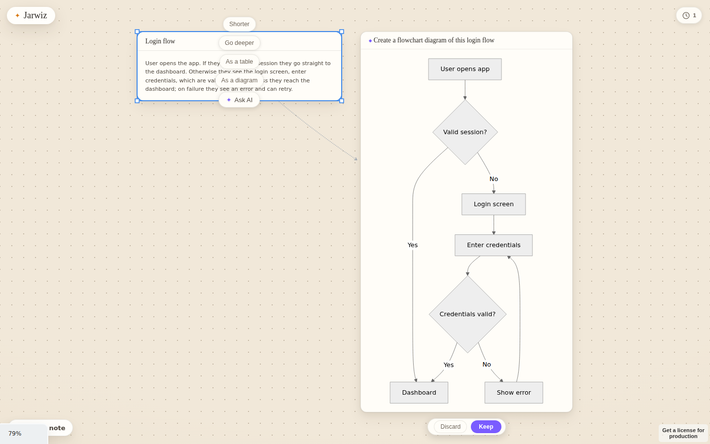
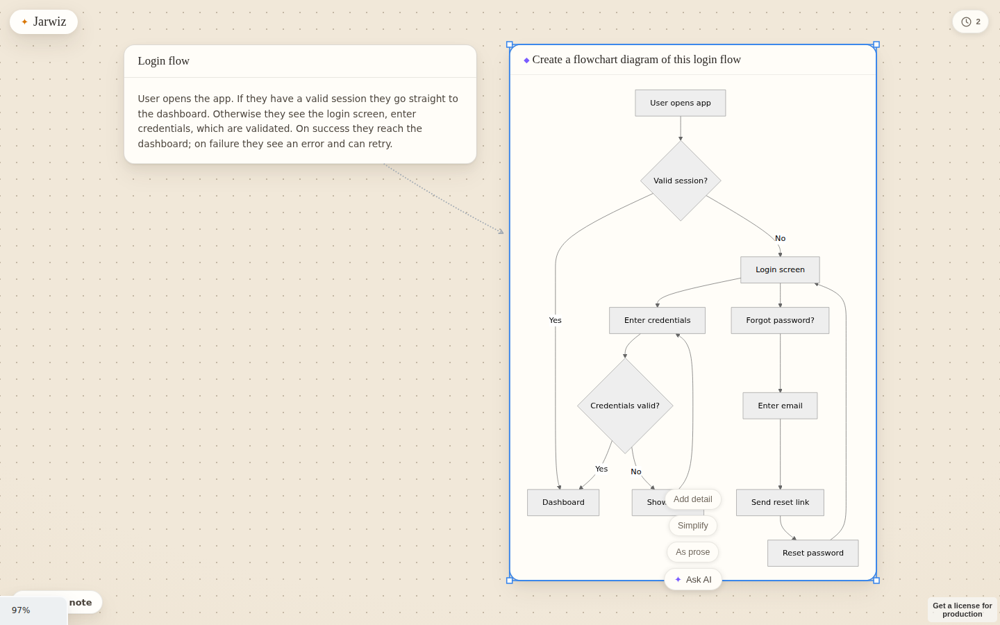
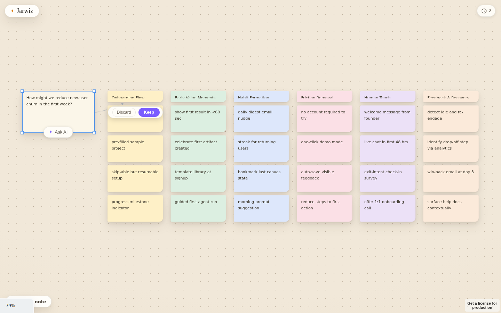
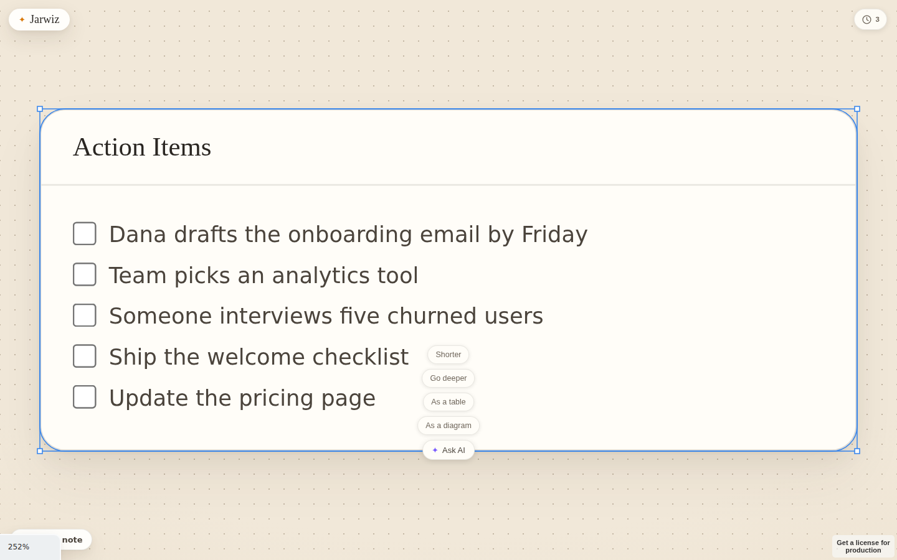
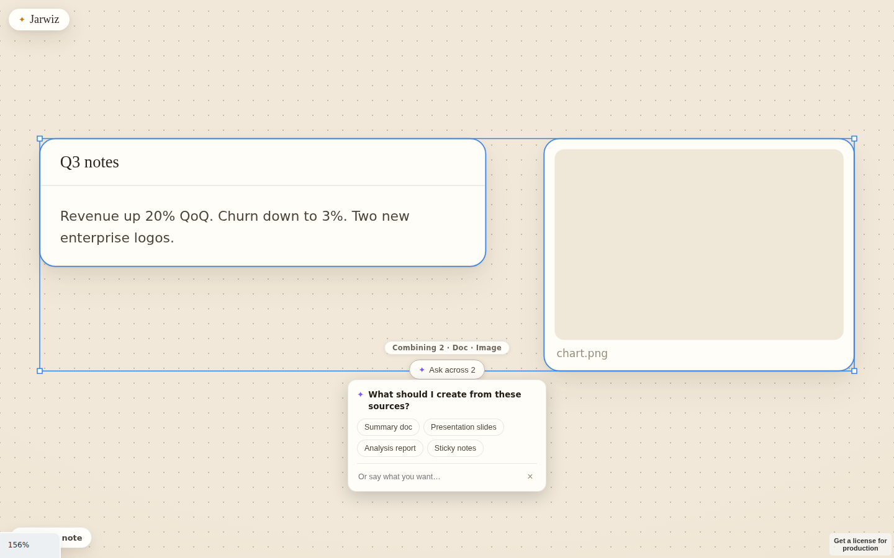
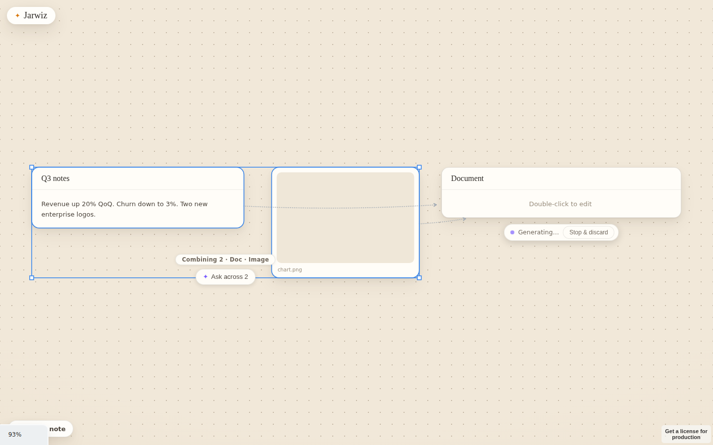

# Jarwiz — Test & Usability Report

_Date: 2026-06-16 · Branch: `claude/tender-sagan-rxmrbk` · Build: production `vite preview` + Hono server (Claude CLI sidecar)_

A full pass over what we've built so far: automated evals, end-to-end runs against
a real model, and synthetic-persona usability walkthroughs — with screenshots and
a prioritised list of what to improve next.

How to reproduce (preview + server up):

```bash
npm run build --workspace=apps/web
npm run dev --workspace=apps/server          # :3001  (background)
npm run preview --workspace=apps/web -- --port 5173 --strictPort   # (background)
node scripts/eval-suite.mjs       # client rendering surface
node scripts/eval-inplace.mjs     # in-place regeneration behaviour
node scripts/eval-personas.mjs    # real Ask flows, 3 personas
```

---

## 1. Scorecard

| Suite | Result | What it proves |
|---|---|---|
| Server routing (curl) | **3/3** | Refinements keep shape; format/prose requests branch |
| Client rendering (`eval-suite.mjs`) | **15/16** | Every card renders; 1 real UX finding (dock overlap) |
| In-place regeneration (`eval-inplace.mjs`) | **8/8** | Same card updated; Cmd+Z restores exactly |
| Persona end-to-end (`eval-personas.mjs`) | **4/5** | Live pipeline works; 1 harness timeout (feature OK) |

**30 automated checks pass.** Two non-passes: one genuine bug (sticky-note dock
overlaps tldraw's navigation panel) and one test-harness timeout where the feature
actually rendered correctly (slow dev sidecar call).

---

## 2. Server routing (the in-place decision)

Refinements carry the selected card's `currentShape`; the server keeps that shape
unless the prompt explicitly names a different format.

| Input | `currentShape` | Routed to | Correct? |
|---|---|---|---|
| "add another node" | diagram | **diagram** (in place) | ✅ |
| "reformat as a comparison table" | diagram | **table** (new card) | ✅ |
| "rewrite as a short written summary" | table | **doc** (new card) | ✅ |

A bug was found and fixed during testing: `/api/ask` was rebuilding the request
object and silently dropping `currentShape`, so every refinement fell back to the
prose router. Now forwarded with a whitelist.

---

## 3. Client rendering surface — 15/16

✅ Empty state · ✅ Sticky note via `n` key · ✅ Sticky note via dock handler ·
✅ Doc markdown headings · ✅ Task list → 3 live checkboxes · ✅ Toggling a checkbox
rewrites the source line · ✅ Table grid (9 cells) · ✅ Diagram renders SVG ·
✅ **Diagram has no Expand toggle** · ✅ **Diagram not clamped** · ✅ **Diagram card
height fits the whole diagram** (387px card for a 311px SVG) · ✅ Affinity board (5
notes) · ✅ Refine chips for doc / table / diagram cards.

❌ **Dock button reachable** — the "Sticky note" dock button (bottom-left) is
overlapped by tldraw's navigation panel, which intercepts the click. The handler
works (a direct DOM click drops a note); the button is just not reliably clickable
where it sits. See Findings.

### Diagram renders whole (the requested fix)

Diagram cards no longer clamp or show an Expand toggle — the card grows to the full
rendered diagram, so nothing is scrolled or truncated. A tall mindmap renders in
full:



### Checklists are live inside cards

`- [ ]` task lines render as real checkboxes; toggling one rewrites the card's
source text (`- [ ]` ↔ `- [x]`).



---

## 4. In-place regeneration — 8/8

Selecting an answer card and asking a same-type tweak rewrites **that** card:
same id, no new shape, content changed; a single Cmd+Z restores the prior content
exactly (the clear + every streamed delta are squashed into one history step).
"Shorter" took a 456-char doc to 303 chars in place.

---

## 5. Synthetic-persona walkthroughs (real model) — 4/5

### Maya — PM, competitive analysis

"Compare these three tools as a table" → a grounded comparison table beside the
source, linked by a provenance edge. **6.1s.**



### Devin — engineer, system mapping + in-place refine

"Create a flowchart diagram of this login flow" → a full flowchart (**7.9s**). Then,
with the diagram selected, "Add a node for password reset" updated **the same card**
— a complete reset branch (Login screen → Forgot password? → Enter email → Send
reset link → Reset password) appended, original flow preserved, no second card
(**5.7s**). This is the headline interaction working end to end on a real model.




### Sam — researcher, ideation + action items

"Brainstorm ideas as clustered sticky notes" → a colour-coded affinity board of
clusters (**12.1s**). "Extract the action items as a checklist" → an Action Items
card with five live checkboxes from the notes (rendered correctly; the harness's
120s wait was just short of the 122s the dev sidecar took — see Findings).




---

## 6. Findings & what to improve next

**Prioritised.** P1 = fix soon (correctness/clear friction), P2 = polish, P3 = nice-to-have.

1. **[P1] Sticky-note dock overlaps tldraw's navigation panel.** Both live
   bottom-left; the nav panel intercepts clicks so the dock button is effectively
   unclickable there. Fix by repositioning the dock (e.g. bottom-center, or above
   the nav panel) or nulling/relocating tldraw's `NavigationPanel`. _Caught by the
   eval; reproduced reliably._

2. **[P1] Follow-up / refine chips overlap card content.** The chips
   (Shorter / Go deeper / As a table …) float over the bottom-center of the source
   card, sitting on top of its text or diagram (visible in the Maya and Devin
   shots). Move them clear of the card's body — below its bottom edge or to the
   side — or reveal on hover.

3. **[P2 · FIXED] In-place regeneration has no progress/cancel affordance.** Now
   shows a "Regenerating…" pill with a **Cancel** under the card while it streams
   (`RegenControls`). Cancel aborts the model call and bails the history mark, so
   the card's previous content is restored exactly. _Eval: `eval-regen-cancel.mjs`,
   3/3._

4. **[P2 · FIXED] No real cancel on long Asks.** "Stop & discard" on a streaming
   draft now actually aborts the in-flight model call (`cancelActiveAsk`), not just
   hides the card. (Dev sidecar latency remains high/variable; production uses the
   streaming Anthropic API.)

5. **[P2] Affinity can over-generate** (one brainstorm produced ~31 notes across 5
   clusters). Readable but dense. Consider capping notes/cluster or laying clusters
   out with more breathing room.

6. **[P3] Wide diagrams scale down to card width** and can get small. Now that
   height is unconstrained, consider letting very wide diagrams widen the card too,
   so labels stay legible.

7. **[P3] No "refine the last answer" entry without selecting it.** Every Ask path
   requires a selection, so the "infer the most recent response" half of the
   in-place design has no trigger today. A ⌘K "refine last answer" or a persistent
   ask bar would complete it. (We do auto-select a kept answer, which covers most
   of the gap.)

8. **[P3] Table in-place edits re-stream the whole grid.** "Add a row" regenerates
   and refills every cell rather than appending, which flickers. Functional, but a
   diff-and-append would feel smoother.

---

## 7. Follow-up changes landed after this pass

- **In-place regen progress + cancel** (findings 3 & 4) — `RegenControls` pill with
  Cancel; "Stop & discard" now truly aborts the model. Evals: `eval-regen-cancel.mjs` (3/3).
- **Full table editing** — table cards now support add/edit/**delete** for both rows
  and columns (a corner × per header, a × per row in a trailing gutter), on top of
  the existing cell editing and Tab-to-fill. Eval: `eval-table.mjs` (7/7).

## 8. Combine sources + disambiguation (new)

Three capabilities landed together (`eval-combine.mjs`, 4/4):

- **Images as context (vision).** Image cards are now Ask sources — selecting an
  image (alone or with other cards) shows the Ask affordance, and the image is
  sent to the model as a vision input on the API path. (The dev sidecar is
  text-only, so it notes the image but can't see it; verified it degrades to a
  card rather than erroring.)
- **Multi-source combining affordance.** A multi-select shows "Combining N · Doc ·
  Image · …", so it's clear what a single Ask will fuse.
- **Disambiguation.** When a request is genuinely ambiguous, the server returns one
  short question with tappable options instead of guessing (a cheap heuristic gate
  + a triage pass — biased hard toward acting, so clear requests never get asked).
  Answering re-runs the same Ask with the answer folded in and both sources wired
  to the result.




_Server routing verified by curl: "do something with these" (doc + image) → a
`clarify` event with options; "summarize this document" → straight to a doc, no
question._

## 9. Coverage gaps (not yet evaluated here)

The older agent surface — Summarizer / Writer / Brainstormer / Researcher,
@mention, the ⌘K command palette, comment threads with agent voice, and
Tab-to-continue Autopilot — was not re-evaluated in this pass; it has its own
harnesses (`scripts/verify-m1.mjs`, `verify-m2.mjs`, `eval-ui.mjs`). PDF ingestion
and seed prompts were exercised indirectly (the Ask pipeline) but not via a real
file upload in this run.
